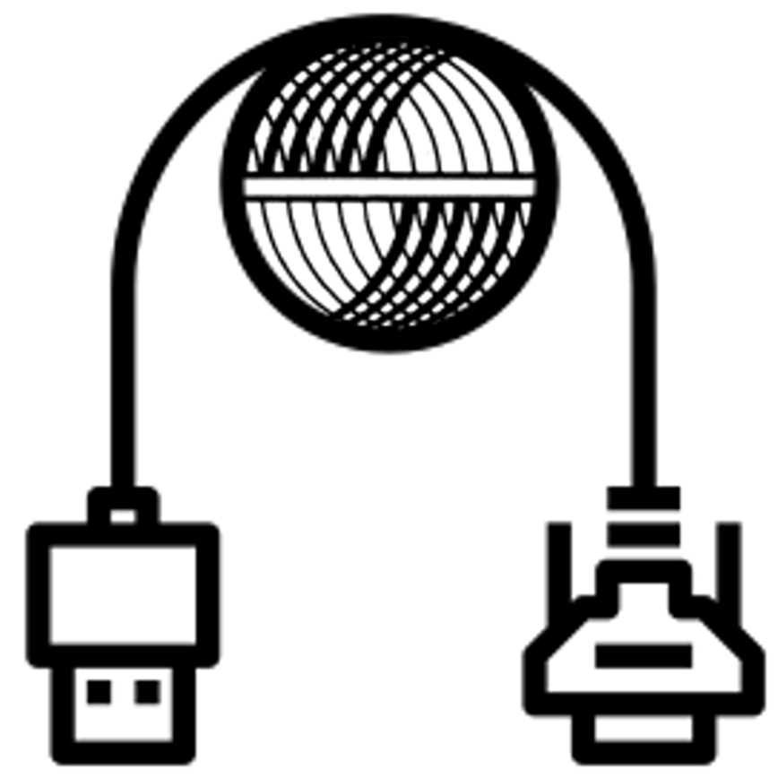

</img>
<h3 style="text-align: center;">Project ARC - Additional RS-232 Circuitry</h3>

## Introduction

This project (Project ARC) is a spin-off from my Sphere-1 reconstruction project, in that it provides additional functionality (in the form of an RS-232 interface) which was not present on the original CPU/2 board. 

Additional components would need to be purchased.

This project aims to make adding RS-232 capability to the CPU/2 board simpler and more modular in its approach.

The documentation is stored on Google Docs for reference - the link is below.

## Documentation

[History and Description of the project](https://drive.google.com/drive/folders/1ViCCd09BQsjbNeUuYninBBR5Ygf1v3um?usp=sharing)
